## Hi I'm Daniel 👋 

## About me
I'm a DevOps Engineer who loves to optimize and automate development for everyone. Previously I studied game development where I focused more on tools and found interest in backend engineering, soon enough I found out about DevOps and realized that it felt more like home. And from that point forward I've kept going.

## Experiance

## Current activities
- 🌱 I’m currently learning about GCP

<!--
Here are some ideas to get you started:

- 👯 I’m looking to collaborate on ...
- 🤔 I’m looking for help with ...
- 💬 Ask me about ...
- 📫 How to reach me: ...
- 😄 Pronouns: ...
- ⚡ Fun fact: ...
- 🔭 I’m currently working on 
-->
